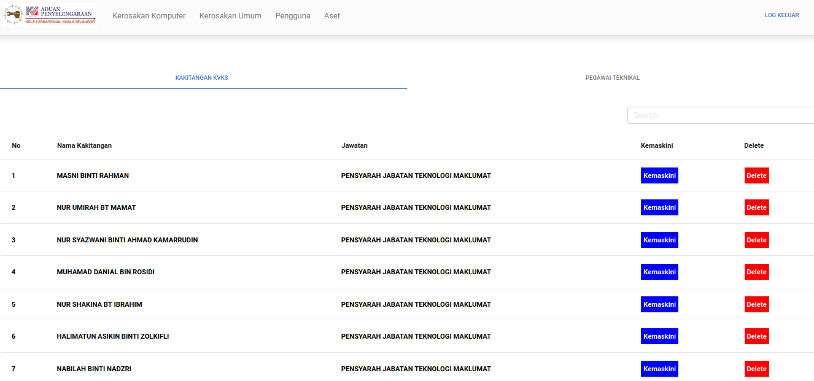

# ePenyelengaraan

Sistem ePenyelengaraan adalah sebuah sistem yang membolehkan para warga kolej vokasional mengadukan permasalahan sekitar.
Ia Dibangunkan hasil kerjasama pelajar Teknologi Pengurusan Pangkalan Data dan Jabatan Teknologi Maklumat dan diaplikasikan oleh unit penyelanggaraan KVKS. 

## Kelebihan 
#### Mudah Digunakan
Penghantaran aduan kerosakan kepada pegawai teknikal hanya dihujung jari.

#### Pantas
Aduan kerosakan yang diterima akan dapat diselesaikan dengan secepat yang mungkin.

#### Aduan Berpusat
Rekod aduan dan penyelenggaraan secara sistematik dan berpusat.

## Gambaran Sistem

